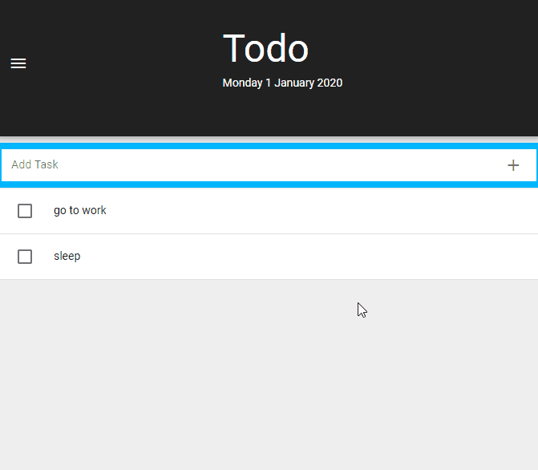

# TODO LIST

I built this page to practice my frontend skills with Quasar and Vue.js.

This is a page that allows users to add tasks to a todo list. 

Users can delete their tasks.  

Click here: [Demo](https://walter-clayton.github.io/quasartodolist/)

## Features

* Add Tasks
* Delete Tasks
* Flash messages
* User Interface with profile picture and tab bar

## Built with

* HTML5
* SCSS
* QUASAR
* VUE.js

## Instructions for contributors

if you would like to contribute on GitHub :smiley:
* QUASAR [instructions](quasar.md)
* GitHub [instructions](contributions.md)

## Author

**Walter Clayton** 
* :octocat: [GitHub Profile](https://github.com/walter-clayton)
* :bowtie: [LinkedIn](https://www.linkedin.com/in/walter-clayton-2b50b4191/)

## Copyright

&copy; 2019 Walter Clayton, All Rights Reserved
